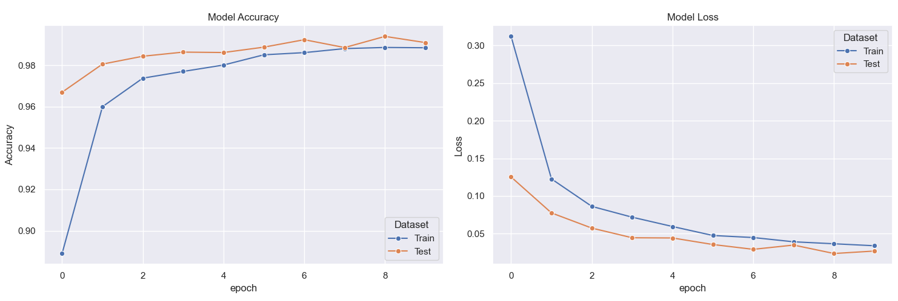
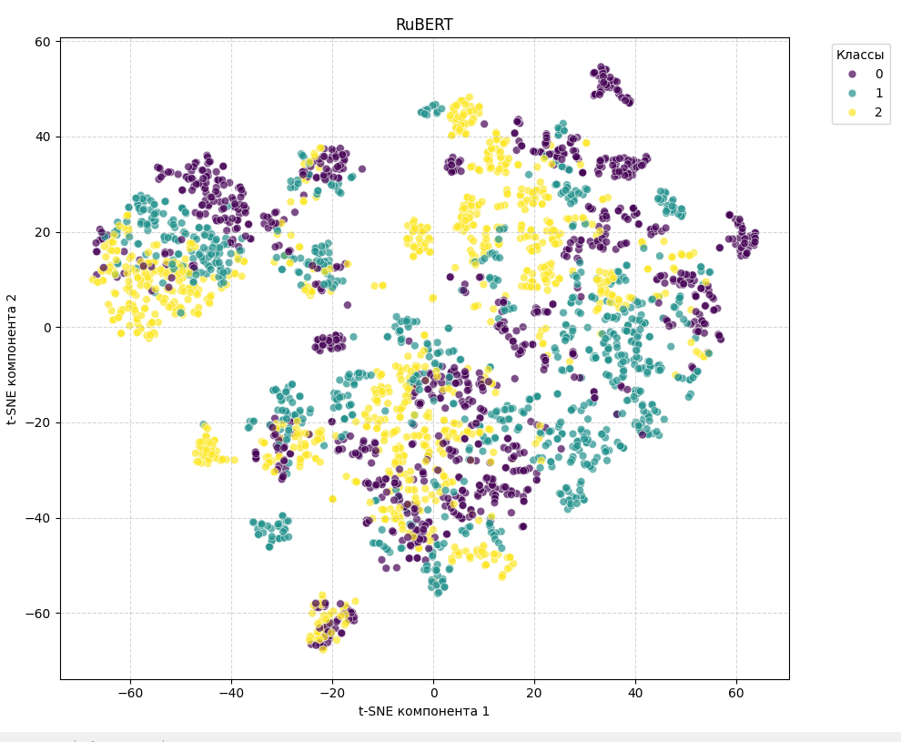

# Rutina Neural Network

`Rutina Neural Network` — это NLP-сервис для классификации пользовательских запросов по трём категориям и подбора релевантного совета из заранее подготовленной базы.

Проект объединяет:
- `RuBERT` для понимания текста
- компактный нейросетевой классификатор для определения категории
- семантический поиск внутри выбранной категории
- `CrossEncoder` для финального переранжирования кандидатов

Сервис развёрнут как микросервис на `FastAPI` и может использоваться как отдельный backend для системы рекомендаций.

## Что Делает Модель

Пайплайн предсказания работает по шагам:

1. Пользователь отправляет текстовый запрос.
2. Текст векторизуется через `RuBERT`.
3. Классификатор предсказывает один из трёх классов:
   - `0` — питание
   - `1` — спорт
   - `2` — учёба / продуктивность
4. Из базы советов берутся только тексты внутри предсказанной категории.
5. Для этих советов выполняется семантический поиск через sentence embeddings и cosine similarity.
6. Оценки кандидатов дополнительно усиливаются за счёт буквального совпадения слов.
7. `CrossEncoder` переранжирует top-кандидатов и выбирает финальный совет.

Кратко:

`запрос -> RuBERT -> классификатор -> категория -> retrieval -> reranker -> совет`

## Технологический Стек

- `Python`
- `FastAPI`
- `PyTorch`
- `transformers`
- `sentence-transformers`
- `scikit-learn`
- `NumPy`

## Структура Проекта

- `main.py` — точка входа FastAPI-сервиса
- `src/ruBERT.py` — векторизация текста через `DeepPavlov/rubert-base-cased`
- `src/classifier.py` — архитектура классификатора
- `src/train.py` — обучение классификационной модели
- `src/predict.py` — основной пайплайн: классификация, retrieval и reranking
- `src/api/schemas/` — схемы запроса и ответа
- `data/` — датасеты, eval-примеры и база советов
- `model/` — обученные артефакты и сериализованный индекс советов
- `reports/metrics/` — скрипты для оценки классификации и предикта
- `reports/grids/` — скрипты для построения графиков обучения и визуализаций

## Метрики Классификации

### Метрики На Грязных Данных, Написанных Вручную

Эти метрики получены на вручную составленных пользовательских запросах с шумом, разговорными формулировками и менее структурированным стилем.

```text
              precision    recall  f1-score   support

           0       0.83      0.78      0.81        32
           1       0.73      0.87      0.79        31
           2       0.89      0.78      0.83        32

    accuracy                           0.81        95
   macro avg       0.82      0.81      0.81        95
weighted avg       0.82      0.81      0.81        95
```

Эта проверка особенно полезна, потому что лучше отражает реальные пользовательские запросы, чем идеально подготовленный датасет.

### Метрики На Тестовой Выборке Из Датасета

Эти метрики получены на отложенной тестовой части датасета:

```text
              precision    recall  f1-score   support

           0       0.99      0.99      0.99      1650
           1       0.99      0.99      0.99      1658
           2       0.99      0.99      0.99      1692

    accuracy                           0.99      5000
   macro avg       0.99      0.99      0.99      5000
weighted avg       0.99      0.99      0.99      5000
```

Эти результаты показывают, что классификатор очень хорошо работает на структурированных данных, но оценка на шумных запросах лучше отражает поведение модели в реальных условиях.

## Визуальный Анализ

В проекте также используются визуализации:

- графики `accuracy` и `loss` по эпохам
- двумерная `t-SNE`-проекция эмбеддингов `RuBERT`

Такие графики помогают анализировать:
- сходимость обучения
- разделимость классов в embedding space
- разницу между поведением модели на чистом датасете и на шумных реальных запросах

### Графики Обучения



На графиках видно, что модель быстро выходит на высокий уровень точности, а `loss` стабильно снижается как на train, так и на test части выборки.

### Визуализация Эмбеддингов RuBERT



Двумерная `t-SNE`-проекция эмбеддингов показывает, как распределяются объекты разных классов в пространстве признаков `RuBERT`.

## API

По умолчанию сервис запускается на `http://127.0.0.1:8000`.

### `GET /`

Эндпоинт для проверки работоспособности сервиса.

Ответ:

```json
{
  "message": "this is rutina neural network service"
}
```

### `POST /advice`

Основной эндпоинт для классификации запроса и подбора совета.

Тело запроса:

```json
{
  "habit": "Бег 400м 5 подходов с максимальным восстановлением"
}
```

Ответ:

```json
{
  "advice": "Текст подобранной рекомендации"
}
```

## Как Запустить

### 1. Установить зависимости

```bash
pip install -r requirements.txt
```

### 2. Запустить API

```bash
python main.py
```

### 3. Пересобрать индекс советов при необходимости

```bash
python -m src.predict
```

Эта команда пересоздаёт `model/tips.pt` на основе `data/tips.json`.

